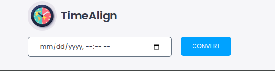
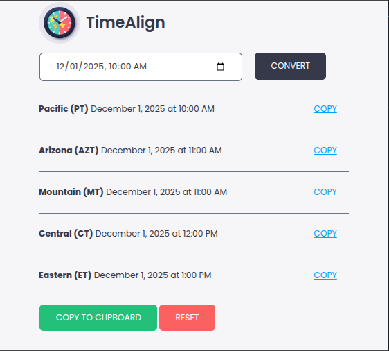

# TimeAlign – US Time Zone Converter for Meeting Proposals

**TimeAlign** is a simple Chrome Extension that helps you convert a proposed date and time into equivalent times across all major U.S. time zones. It's designed to make scheduling with distributed teams easy and clear.

---

## 🕒 Features

- Enter any date and time using your local timezone
- Instantly see conversions for:
  - Pacific Time (PT)
  - Arizona Time (AZT)
  - Mountain Time (MT)
  - Central Time (CT)
  - Eastern Time (ET)
- Copy individual timestamps or the full list to clipboard
- Clean and minimal user interface

---

## 📸 Screenshots

---

## 🚀 Installation (Development Mode)

To load the extension manually in Chrome:

1. Clone or download this repository
2. Go to `chrome://extensions` in Chrome
3. Enable **Developer mode** (top right)
4. Click **Load unpacked**
5. Select the folder containing the extension files

---

## 🔐 Permissions

The extension requests the following permission:

- `clipboardWrite`: Used to copy the converted times to the clipboard when users click a copy button. Clipboard access is only triggered by user actions.

No user data is collected, stored, or transmitted.

---

## 💡 Why Use This?

Working with teammates in different time zones? Instead of guessing or asking "What time is that for you?", use TimeAlign to:

- Propose meeting times clearly
- Copy timezone-aligned text to Slack, email, or calendars
- Avoid timezone confusion across U.S.-based teams

---

## 🛠️ Future Ideas

- Support for international time zones
- Output formatting for Slack, Markdown, or Google Calendar
- Dark mode support

Contributions are welcome! Please open an issue or submit a pull request if you'd like to help improve this extension.

---

## 📃 License

MIT License
© 2025 Rodney Gauna

---

## 📧 Contact

For questions, feedback, or feature requests, please open an issue on GitHub or contact me at <rodneygauna@gmail.com>

---

## Acknowledgments

Thanks to the open-source community for providing the tools and libraries that made this extension possible. Special thanks to the developers of

- [Chrome Extensions](https://developer.chrome.com/docs/extensions/mv3/getstarted/) for their documentation and support.
- [Modernize CSS](https://modernizecss.com/) for the CSS framework used in this project.
- [Zesty UX CSS](http://zestyux.com/) for the inspiration behind the clean design.

## Check out my other projects

- [Rodney Gauna's GitHub](https://github.com/rodneygauna) for more open-source projects and contributions.
- [Rodney.Codes](http://rodney.codes) for my personal website.
- [Rodney Gauna on LinkedIn](https://www.linkedin.com/in/rodneygauna) to connect professionally.
